```mermaid
flowchart LR

A[Python Transaction Producer]
B[Apache Kafka - transactions topic]
C[PySpark Structured Streaming]
D[Bronze Layer - Raw Transactions]
E[Silver Layer - Cleaned & Enriched Data]
F[Gold Layer - Fraud Detection & Risk Scoring]
G[PostgreSQL - Star Schema Data Warehouse]
H[Power BI - Fraud Analytics Dashboard]

A --> B
B --> C
C --> D
D --> E
E --> F
F --> G
G --> H
```

# Real-Time Fraud Detection & Risk Scoring Platform

An end-to-end Data Engineering platform that simulates real-time banking transactions, processes them through Kafka and PySpark Structured Streaming, applies rule-based fraud detection and risk scoring, follows a Medallion Architecture, loads curated data into a PostgreSQL Star Schema data warehouse, and visualizes fraud analytics using Power BI.


## Project Overview

Financial transaction systems generate large volumes of events that need to be processed quickly and reliably.

This project demonstrates a complete pipeline for real-time fraud monitoring:

**Transaction Producer → Kafka → PySpark Structured Streaming → Bronze → Silver → Gold → PostgreSQL Data Warehouse → Power BI**

The platform demonstrates:

- Real-time event streaming
- Distributed data processing
- Medallion Architecture
- Data cleansing and enrichment
- Rule-based fraud detection and risk scoring
- Data quality validation
- Incremental processing
- Dimensional data modeling
- Star Schema
- PostgreSQL data warehousing
- Business Intelligence reporting


## Architecture



# Technology Stack

| Technology                 | Purpose                                   |
| -------------------------- | ----------------------------------------- |
| Python                     | Transaction generation and ETL logic      |
| Apache Kafka               | Real-time transaction event streaming     |
| Kafka UI                   | Kafka topic and message monitoring        |
| PySpark                    | Distributed stream processing             |
| Spark Structured Streaming | Real-time transaction processing          |
| Medallion Architecture     | Bronze, Silver and Gold data organization |
| PostgreSQL                 | Analytical data warehouse                 |
| Star Schema                | Dimensional data modeling                 |
| Power BI                   | Interactive fraud analytics dashboard     |
| Docker                     | Containerized Kafka infrastructure        |
| Git & GitHub               | Version control and project management    |

# Data Pipeline

## 1. Transaction Generation

A Python transaction producer generates simulated banking transactions containing:

* Transaction ID
* Customer ID
* Transaction amount
* Currency
* Merchant
* Merchant category
* Payment method
* Device
* City
* Country
* Timestamp

The producer publishes transactions to the Kafka `transactions` topic.

The current demonstration generates **1,000 transactions**.

---

## 2. Kafka Streaming Layer

Apache Kafka acts as the event streaming platform.

```text
Python Producer
      ↓
Kafka
      ↓
transactions topic
```

Kafka decouples transaction generation from downstream processing and provides a reliable event-streaming layer.

Kafka UI is used to monitor topics and incoming transaction events.


# Medallion Architecture

The pipeline follows a Bronze → Silver → Gold architecture.

## Bronze Layer

The Bronze layer stores raw transaction events received from Kafka.

Responsibilities:

* Preserve raw transaction data
* Maintain the original event structure
* Provide a recoverable source for downstream processing
* Separate ingestion from transformation

```text
Kafka
  ↓
Bronze
```

## Silver Layer

The Silver layer cleans and prepares raw transaction data.

Processing includes:

* Data type conversion
* Schema enforcement
* Data validation
* Standardization
* Preparing transaction data for analytical processing

```text
Bronze
  ↓
Silver
```


## Gold Layer

The Gold layer contains business-ready transaction data.

Fraud detection and risk scoring logic is applied at this stage.

The Gold layer produces curated data suitable for:

* Analytics
* Data warehousing
* Fraud investigation
* Power BI reporting

```text
Silver
  ↓
Gold
```


# Fraud Detection & Risk Scoring

The project uses rule-based fraud detection and risk scoring.

Transactions are evaluated using business rules based on transaction characteristics such as transaction amount and risk conditions.

Transactions receive:

* Fraud Flag
* Risk Score
* Risk Level
* Amount Category

Risk levels are categorized as:

```text
LOW
MEDIUM
HIGH
```

The current demonstration dataset produces both legitimate and fraud-like transactions so that downstream analytics can demonstrate fraud monitoring.

---

# Data Quality

Data quality checks are included as part of the pipeline.

The repository contains validation scripts:

```text
check_bronze_duplicates.py
check_silver_duplicates.py
check_gold_duplicates.py
```

These checks help identify duplicate records across the Medallion layers.

Duplicate detection is important in streaming systems because repeated processing should not create duplicate analytical records.

---

# PostgreSQL Data Warehouse

The Gold layer is loaded into PostgreSQL as an analytical data warehouse.

The warehouse follows a **Star Schema** design.

## Fact Table

```text
fact_transactions
```

Contains transaction-level information such as:

* Amount
* Fraud flag
* Risk score
* Date key
* Customer key
* Device key
* Merchant key

## Dimension Tables

```text
dim_customer
dim_date
dim_device
dim_merchant
```

The fact table connects to dimensions through surrogate keys.

```text
                 dim_customer
                      |
                      |
dim_date ---- fact_transactions ---- dim_merchant
                      |
                      |
                 dim_device
```

This structure makes the warehouse suitable for analytical queries and BI workloads.


# ETL to PostgreSQL

The Gold-to-PostgreSQL ETL process prepares curated Gold data for warehouse loading.

Main responsibilities include:

* Reading Gold data
* Preparing dimension records
* Loading dimension tables
* Maintaining fact/dimension relationships
* Loading transaction records
* Handling duplicate records
* Preparing data for analytical querying

Main ETL script:

```text
etl/gold_to_postgres.py
```


# Power BI Dashboard

Power BI connects directly to the PostgreSQL data warehouse.

The dashboard provides an executive view of the fraud detection system.

## Dashboard Metrics

* Total Transactions
* Fraud Transactions
* Fraud Rate
* Total Transaction Amount
* Average Risk Score

## Analytical Visualizations

* Fraud vs Legitimate Transactions
* Risk Level Distribution
* Transaction Amount Category
* Fraud Transactions by Merchant Category
* Fraud Transactions by Payment Method
* Fraud Transactions by City
* Recent High-Risk / Fraudulent Transactions

## Interactive Filters

* Date Range
* Risk Level
* Fraud Flag
* Merchant Category
* Payment Method
* City

### Dashboard Preview


# Project Structure

```text
RealTimeFraudDetectionPlatform/
│
├── etl/
│   └── gold_to_postgres.py
│
├── producer/
│   └── transaction_producer.py
│
├── streaming/
│   ├── kafka_stream.py
│   ├── bronze_stream.py
│   ├── silver/
│   │   └── _stream.py
│   └── gold/
│       └── _stream.py
│
├── check_bronze_duplicates.py
├── check_silver_duplicates.py
├── check_gold_duplicates.py
│
├── docker-compose.yml
├── .gitignore
└── README.md
```


# Running the Project

## Prerequisites

Install:

* Python
* Java / JDK
* PySpark
* Docker Desktop
* PostgreSQL
* Git


## 1. Clone the Repository

```bash
git clone https://github.com/aponni2004-design/Real-Time-Fraud-Detection-Risk-Scoring-Platform.git
cd Real-Time-Fraud-Detection-Risk-Scoring-Platform
```


## 2. Start Kafka Infrastructure

```bash
docker compose up -d
```

Verify the containers:

```bash
docker compose ps
```

Kafka UI can be used to monitor the Kafka environment.


## 3. Start the Transaction Producer

```bash
python producer/transaction_producer.py
```

The producer publishes simulated transaction events to the Kafka topic:

```text
transactions
```


## 4. Run the Streaming Pipeline

The PySpark streaming components process incoming Kafka transactions through the Medallion layers:

```text
Kafka
  ↓
Bronze
  ↓
Silver
  ↓
Gold
```


## 5. Load Gold Data into PostgreSQL

```bash
python etl/gold_to_postgres.py
```

The curated Gold data is loaded into the PostgreSQL warehouse.


## 6. Connect Power BI

Connect Power BI to:

```text
Server: localhost:5432
Database: fraud_detection_dw
```

Use the PostgreSQL warehouse tables for the analytical dashboard.


# Key Engineering Decisions

## Why Kafka?

Kafka provides a decoupled event-streaming layer between transaction producers and downstream processing.

Instead of directly sending every transaction to the database, events first enter Kafka, allowing downstream consumers to process them independently.


## Why PySpark?

PySpark Structured Streaming provides distributed processing capabilities and is better suited to large-scale transaction processing than a simple Pandas-based pipeline.

The architecture can be extended to larger transaction volumes by scaling the streaming infrastructure.


## Why Bronze, Silver and Gold?

The Medallion Architecture separates responsibilities:

```text
Bronze → Raw ingestion
Silver → Cleaned and standardized data
Gold   → Business-ready analytical data
```

This improves maintainability, traceability and data quality.


## Why PostgreSQL?

PostgreSQL provides a relational analytical layer where curated Gold data can be modeled into a Star Schema and queried by BI tools.


## Why Star Schema?

The Star Schema separates:

**Facts**

from

**Dimensions**

This simplifies analytical queries and makes the warehouse easier for Power BI and other BI tools to consume.


# Scalability Considerations

The current implementation uses simulated data for demonstration and portfolio purposes.

For a production-scale implementation, the architecture could be extended with:

* Kafka partitioning
* Multiple Spark workers
* Larger Kafka clusters
* Schema Registry
* Delta Lake or Apache Iceberg
* Cloud object storage
* Data orchestration
* Automated data quality monitoring
* CI/CD pipelines
* Secrets management
* Observability and alerting
* Distributed or cloud data warehouse
* Real-time machine learning fraud models


# Project Outcomes

The completed platform demonstrates an end-to-end Data Engineering workflow:

```text
Generate Events
      ↓
Stream Events
      ↓
Process in Spark
      ↓
Bronze
      ↓
Silver
      ↓
Gold
      ↓
Fraud Detection
      ↓
PostgreSQL Warehouse
      ↓
Power BI Analytics
```

The project demonstrates practical knowledge of:

* Python
* SQL
* Kafka
* PySpark
* Structured Streaming
* ETL
* Medallion Architecture
* Data Quality
* Data Warehousing
* Star Schema
* PostgreSQL
* Power BI
* Docker
* Git/GitHub

# Author

**Ponni A**

Biotechnology Graduate → Aspiring Data Engineer

Interested in building scalable data pipelines, real-time processing systems and analytical data platforms.

## Disclaimer

This project uses simulated transaction data for educational and portfolio purposes. It does not process real banking or financial information.