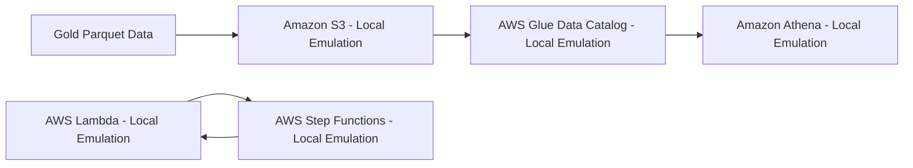
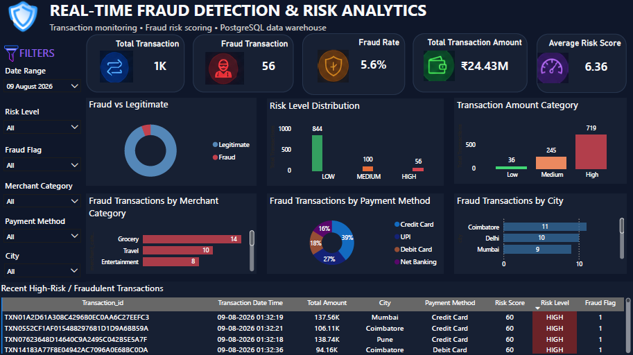

# Real-Time Fraud Detection & Risk Scoring Platform

An end-to-end Data Engineering platform that simulates real-time banking transactions, streams events through Apache Kafka, processes them using PySpark Structured Streaming, applies rule-based fraud detection and risk scoring, follows a Bronze → Silver → Gold Medallion Architecture, loads curated data into a PostgreSQL Star Schema data warehouse, and visualizes fraud analytics using Power BI.

The platform was further extended with a **locally emulated AWS data lake and serverless architecture** using S3, Glue Data Catalog, Athena, Lambda, and Step Functions through Floci.

> **Note:** AWS services in the cloud extension are locally emulated for portfolio and learning purposes. This project does not claim deployment to a production AWS account.

---

# Project Overview

Financial transaction systems generate large volumes of events that need to be processed quickly, reliably, and consistently.

This project demonstrates a complete data engineering workflow for real-time fraud monitoring:

```text
Transaction Producer
        ↓
Apache Kafka
        ↓
PySpark Structured Streaming
        ↓
Bronze
        ↓
Silver
        ↓
Gold
        ↓
PostgreSQL Data Warehouse
        ↓
Power BI Analytics
```

The platform demonstrates practical experience with:

* Real-time event streaming
* Distributed data processing
* Medallion Architecture
* Data cleansing and enrichment
* Rule-based fraud detection
* Risk scoring
* Data quality validation
* Incremental processing
* Dimensional data modeling
* Star Schema
* PostgreSQL data warehousing
* Business Intelligence reporting
* Cloud-oriented data lake architecture
* SQL-based analytical querying
* Serverless workflow orchestration

---

# Architecture

```mermaid
flowchart LR

A[Python Transaction Producer]
B[Apache Kafka - transactions topic]
C[PySpark Structured Streaming]
D[Bronze Layer - Raw Transactions]
E[Silver Layer - Cleaned & Enriched Data]
F[Gold Layer - Fraud Detection & Risk Scoring]
G[PostgreSQL - Star Schema Data Warehouse]
H[Power BI - Fraud Analytics Dashboard]

A --> B
B --> C
C --> D
D --> E
E --> F
F --> G
G --> H
```



## AWS Data Lake & Serverless Extension



The AWS extension demonstrates how the curated Gold layer can be exposed through cloud-style storage, cataloging, SQL analytics, serverless processing, and workflow orchestration.

---

# Technology Stack

| Technology                              | Purpose                                   |
| --------------------------------------- | ----------------------------------------- |
| Python                                  | Transaction generation and ETL logic      |
| Apache Kafka                            | Real-time transaction event streaming     |
| Kafka UI                                | Kafka topic and message monitoring        |
| PySpark                                 | Distributed stream processing             |
| Spark Structured Streaming              | Incremental transaction processing        |
| Medallion Architecture                  | Bronze, Silver and Gold data organization |
| PostgreSQL                              | Analytical data warehouse                 |
| Star Schema                             | Dimensional data modeling                 |
| Power BI                                | Interactive fraud analytics dashboard     |
| Docker                                  | Containerized Kafka infrastructure        |
| Git & GitHub                            | Version control and project management    |
| Amazon S3 (local emulation)             | Data lake storage                         |
| AWS Glue Data Catalog (local emulation) | Dataset cataloging and schema management  |
| Amazon Athena (local emulation)         | SQL analytics over S3-backed Parquet data |
| AWS Lambda (local emulation)            | Fraud alert classification                |
| AWS Step Functions (local emulation)    | Conditional workflow orchestration        |
| Floci                                   | Local AWS-compatible service emulation    |

---

# Data Pipeline

## 1. Transaction Generation

A Python transaction producer generates simulated banking transactions containing:

* Transaction ID
* Customer ID
* Transaction amount
* Currency
* Merchant
* Merchant category
* Payment method
* Device
* City
* Country
* Timestamp

The producer publishes transactions to the Kafka `transactions` topic.

The normal demonstration generates **1,000 simulated transactions**.

---

# 2. Kafka Streaming Layer

Apache Kafka acts as the event streaming platform.

```text
Python Transaction Producer
          ↓
       Apache Kafka
          ↓
   transactions topic
```

Kafka decouples transaction generation from downstream processing and provides an event-streaming layer between the producer and processing components.

Kafka UI is used to monitor the Kafka environment, topics, and incoming transaction events.

---

# 3. PySpark Structured Streaming

PySpark Structured Streaming consumes transaction events from Kafka and processes them incrementally.

The streaming pipeline separates processing into the following Medallion Architecture:

```text
Kafka
  ↓
Bronze
  ↓
Silver
  ↓
Gold
```

This architecture separates raw ingestion, data preparation, and business-ready processing.

---

# Medallion Architecture

## Bronze Layer

The Bronze layer stores raw transaction events received from Kafka.

Responsibilities include:

* Preserving raw transaction data
* Maintaining the original event structure
* Providing a recoverable source for downstream processing
* Separating ingestion from transformation

```text
Kafka
  ↓
Bronze
```

---

## Silver Layer

The Silver layer cleans and prepares raw transaction data.

Processing includes:

* Data type conversion
* Schema enforcement
* Data validation
* Standardization
* Data preparation for analytical processing

```text
Bronze
  ↓
Silver
```

---

## Gold Layer

The Gold layer contains business-ready transaction data.

Fraud detection and risk scoring logic is applied at this stage.

The Gold layer produces curated data suitable for:

* Analytics
* Data warehousing
* Fraud investigation
* Power BI reporting
* Cloud data lake storage

```text
Silver
  ↓
Gold
```

---

# Fraud Detection & Risk Scoring

The project implements rule-based fraud detection and risk scoring.

Transactions are evaluated using business rules based on transaction characteristics and risk conditions.

Each transaction receives:

* Fraud Flag
* Risk Score
* Risk Level
* Amount Category
* Fraud Reason

Risk levels are categorized as:

```text
LOW
MEDIUM
HIGH
```

The simulated dataset contains both legitimate and fraud-like transactions so that the downstream pipeline and analytics layer can demonstrate fraud monitoring scenarios.

---

# Data Quality

Data quality validation is included across the Medallion layers.

The repository contains duplicate validation scripts:

```text
check_bronze_duplicates.py
check_silver_duplicates.py
check_gold_duplicates.py
```

These checks help identify duplicate transaction records across the Bronze, Silver, and Gold layers.

Duplicate detection is important in streaming and ETL systems because repeated processing should not create duplicate analytical records.

---

# PostgreSQL Data Warehouse

The Gold layer is loaded into PostgreSQL as an analytical data warehouse.

The warehouse follows a **Star Schema** design.

## Fact Table

```text
fact_transactions
```

The fact table contains transaction-level information such as:

* Transaction amount
* Fraud flag
* Risk score
* Date key
* Customer key
* Device key
* Merchant key

## Dimension Tables

```text
dim_customer
dim_date
dim_device
dim_merchant
```

The fact table connects to dimension tables through surrogate keys.

```text
                 dim_customer
                      |
                      |
dim_date ---- fact_transactions ---- dim_merchant
                      |
                      |
                 dim_device
```

This structure provides an analytical model suitable for SQL queries and Power BI reporting.

---

# ETL to PostgreSQL

The Gold-to-PostgreSQL ETL process prepares curated Gold data for warehouse loading.

Main responsibilities include:

* Reading Gold data
* Preparing dimension records
* Loading dimension tables
* Maintaining fact/dimension relationships
* Loading transaction records
* Handling duplicate records
* Preparing data for analytical querying

Main ETL script:

```text
etl/gold_to_postgres.py
```

---

# Power BI Dashboard

Power BI connects to the PostgreSQL data warehouse to provide an analytical view of the fraud detection platform.

## Dashboard Metrics

* Total Transactions
* Fraud Transactions
* Fraud Rate
* Total Transaction Amount
* Average Risk Score

## Analytical Visualizations

* Fraud vs Legitimate Transactions
* Risk Level Distribution
* Transaction Amount Category
* Fraud Transactions by Merchant Category
* Fraud Transactions by Payment Method
* Fraud Transactions by City
* Recent High-Risk / Fraudulent Transactions

## Interactive Filters

* Date Range
* Risk Level
* Fraud Flag
* Merchant Category
* Payment Method
* City

### Dashboard Preview



---

# 10K Transaction Capacity Validation

In addition to the normal 1,000-transaction demonstration, the pipeline was validated using a **10,000-transaction simulated capacity test**.

The test was used to validate the transaction ingestion and downstream fraud-processing flow under a larger event volume.

The validation covered:

```text
10,000 Simulated Transactions
          ↓
       Kafka
          ↓
PySpark Structured Streaming
          ↓
Bronze → Silver → Gold
          ↓
Fraud Detection & Risk Scoring
```

The project does not claim specific throughput or latency measurements because those metrics were not formally benchmarked.

---

# AWS Data Lake & Serverless Extension

The platform was extended with a locally emulated AWS architecture to demonstrate cloud-oriented Data Engineering concepts without requiring a paid AWS account.

The AWS-compatible environment was implemented using **Floci**.

The extension covers:

```text
Gold Parquet Data
       ↓
Amazon S3
       ↓
AWS Glue Data Catalog
       ↓
Amazon Athena
```

and a serverless fraud decision workflow:

```text
Transaction
      ↓
AWS Lambda
      ↓
Risk Decision
   /    |    \
  /     |     \
Fraud  Review  Normal
Alert  Queue   Processing
```

All AWS services in this section are **locally emulated** and are not claimed as production AWS deployments.

---

# Amazon S3 Data Lake

The curated Gold fraud transaction data was stored as Parquet files in a locally emulated S3 bucket.

Logical data lake structure:

```text
s3://fraud-detection-data/
└── gold/
    └── fraud_transactions/
        ├── Parquet files
        └── ...
```

The Gold dataset was uploaded to the local S3-compatible environment and used as the source for the cloud-style analytics layer.

---

# AWS Glue Data Catalog

A local Glue Data Catalog database was created:

```text
fraud_detection
```

The fraud transaction dataset was registered as:

```text
fraud_transactions
```

The catalog captures the schema and storage location of the Parquet dataset.

The cataloged dataset includes fields such as:

```text
transaction_id
customer_id
amount
currency
merchant_id
merchant_category
payment_method
device_id
city
country
transaction_timestamp
amount_category
risk_score
risk_level
fraud_flag
fraud_reason
```

This demonstrates the role of a data catalog in making data lake datasets discoverable and queryable.

---

# Amazon Athena

Amazon Athena was used through the local Floci environment to query the S3-backed Parquet dataset using SQL.

Example analytical query:

```sql
SELECT COUNT(*) AS total_transactions
FROM fraud_transactions;
```

The query successfully returned:

```text
1000
```

This demonstrates SQL-based analytics directly over the cataloged data lake dataset.

---

# AWS Lambda Fraud Alert Processing

A locally emulated Lambda function was implemented to classify transactions based on fraud status and risk score.

Function:

```text
fraud-alert-function
```

The function evaluates:

* `risk_score`
* `fraud_flag`

and produces one of the following outcomes:

```text
HIGH_RISK_FRAUD_ALERT
HIGH_RISK_REVIEW
NORMAL
```

Example high-risk transaction:

```json
{
  "transaction_id": "TXN00000064",
  "risk_score": 92,
  "fraud_flag": 1
}
```

Result:

```json
{
  "transaction_id": "TXN00000064",
  "risk_score": 92,
  "fraud_flag": 1,
  "alert_status": "HIGH_RISK_FRAUD_ALERT"
}
```

---

# AWS Step Functions Workflow

AWS Step Functions was used through the local emulation environment to orchestrate the fraud decision process.

The workflow contains:

```text
FraudAlert
     ↓
RiskDecision
   /  |  \
  /   |   \
Fraud Review Normal
Alert  Review Processing
```

The workflow evaluates the Lambda output and routes the transaction to the appropriate branch.

## Tested Decision Paths

### 1. High-Risk Fraud Alert

Input:

```text
risk_score = 92
fraud_flag = 1
```

Result:

```text
Transaction flagged for fraud alert
```

### 2. High-Risk Manual Review

Input:

```text
risk_score = 80
fraud_flag = 0
```

Result:

```text
Transaction sent for manual review
```

### 3. Normal Transaction

Input:

```text
risk_score = 30
fraud_flag = 0
```

Result:

```text
Transaction classified as normal
```

All three conditional workflow paths were successfully executed and validated.

---

# Local AWS Emulation

The AWS extension uses **Floci** to emulate AWS-compatible services locally.

This approach allows the project to demonstrate cloud architecture concepts without requiring a paid AWS account.

The implementation demonstrates:

* S3-compatible object storage
* Glue-style data cataloging
* Athena-style SQL analytics
* Lambda-based serverless processing
* Step Functions workflow orchestration

The project intentionally distinguishes local AWS emulation from production AWS deployment.

---

# Project Structure

```text
RealTimeFraudDetectionPlatform/
│
├── producer/
│   └── transaction_producer.py
│
├── streaming/
│   ├── kafka_stream.py
│   ├── bronze_stream.py
│   ├── silver/
│   │   └── _stream.py
│   └── gold/
│       └── _stream.py
│
├── etl/
│   └── gold_to_postgres.py
│
├── check_bronze_duplicates.py
├── check_silver_duplicates.py
├── check_gold_duplicates.py
│
├── lambda_handler.py
├── fraud-workflow.json
├── fraud-decision-workflow.json
├── lambda-trust-policy.json
├── lambda-test-event.json
├── lambda-test-review-event.json
├── lambda-test-normal-event.json
├── glue-database.json
├── glue-table.json
│
├── docker-compose.yml
├── .gitignore
└── README.md
```

Generated runtime artifacts such as the Lambda ZIP package, Lambda response files, Spark checkpoints, and generated datasets are excluded from version control where appropriate.

---

# Running the Project

## Prerequisites

Install:

* Python
* Java / JDK
* PySpark
* Docker Desktop
* PostgreSQL
* Git

For the local AWS extension:

* AWS CLI
* Docker
* Floci

---

# 1. Clone the Repository

```bash
git clone https://github.com/aponni2004-design/Real-Time-Fraud-Detection-Risk-Scoring-Platform.git

cd Real-Time-Fraud-Detection-Risk-Scoring-Platform
```

---

# 2. Start Kafka Infrastructure

```bash
docker compose up -d
```

Verify the containers:

```bash
docker compose ps
```

Kafka UI can be used to monitor the Kafka environment.

---

# 3. Start the Transaction Producer

```bash
python producer/transaction_producer.py
```

The producer publishes simulated transaction events to:

```text
transactions
```

---

# 4. Run the Streaming Pipeline

The PySpark streaming components process incoming Kafka transactions through the Medallion layers:

```text
Kafka
  ↓
Bronze
  ↓
Silver
  ↓
Gold
```

---

# 5. Load Gold Data into PostgreSQL

```bash
python etl/gold_to_postgres.py
```

The curated Gold data is loaded into the PostgreSQL warehouse.

---

# 6. Connect Power BI

Connect Power BI to:

```text
Server: localhost:5432
Database: fraud_detection_dw
```

Use the PostgreSQL warehouse tables to build or view the fraud analytics dashboard.

---

# Key Engineering Decisions

## Why Kafka?

Kafka provides a decoupled event-streaming layer between transaction producers and downstream processing.

Instead of directly sending every transaction to a database, events first enter Kafka, allowing downstream consumers to process them independently.

---

## Why PySpark?

PySpark Structured Streaming provides distributed processing capabilities and supports incremental event processing.

The architecture can be extended to larger transaction volumes by scaling the streaming infrastructure.

---

## Why Bronze, Silver and Gold?

The Medallion Architecture separates responsibilities:

```text
Bronze → Raw ingestion
Silver → Cleaned and standardized data
Gold   → Business-ready analytical data
```

This improves maintainability, traceability, and data quality.

---

## Why PostgreSQL?

PostgreSQL provides a relational analytical layer where curated Gold data can be modeled into a Star Schema and queried by BI tools.

---

## Why Star Schema?

The Star Schema separates:

```text
Facts
```

from:

```text
Dimensions
```

This simplifies analytical queries and makes the warehouse easier for Power BI and other BI tools to consume.

---

## Why S3, Glue and Athena?

The locally emulated AWS data lake extension demonstrates a common cloud analytics pattern:

```text
S3
 ↓
Glue Data Catalog
 ↓
Athena
```

S3 provides object storage, Glue provides metadata/cataloging, and Athena provides SQL-based analytical access.

---

## Why Lambda and Step Functions?

Lambda provides event-driven serverless processing for fraud alert classification.

Step Functions provides workflow orchestration and conditional decision-making:

```text
Lambda
  ↓
Risk Decision
  ├── Fraud Alert
  ├── Manual Review
  └── Normal Processing
```

---

# Scalability Considerations

The current implementation uses simulated data for demonstration and portfolio purposes.

The project has been validated with a 10,000-transaction simulated capacity test.

For a production-scale implementation, the architecture could be extended with:

* Kafka partitioning
* Multiple Spark workers
* Larger Kafka clusters
* Schema Registry
* Delta Lake or Apache Iceberg
* Cloud object storage
* Data orchestration
* Automated data quality monitoring
* CI/CD pipelines
* Secrets management
* Encryption and access controls
* Observability and alerting
* Distributed or cloud data warehouse
* Machine-learning-based fraud detection

These are documented production extensions rather than components currently claimed as implemented.

---

# Project Outcomes

The completed platform demonstrates an end-to-end Data Engineering workflow:

```text
Generate Events
      ↓
Stream Events
      ↓
Process in Spark
      ↓
Bronze
      ↓
Silver
      ↓
Gold
      ↓
Fraud Detection
      ↓
PostgreSQL Warehouse
      ↓
Power BI Analytics
```

The cloud-oriented extension adds:

```text
Gold Parquet
      ↓
S3
      ↓
Glue Catalog
      ↓
Athena
```

and:

```text
Transaction
      ↓
Lambda
      ↓
Step Functions
      ↓
Fraud Alert / Manual Review / Normal
```

The project demonstrates practical knowledge of:

* Python
* SQL
* Apache Kafka
* PySpark
* Structured Streaming
* ETL
* Medallion Architecture
* Data Quality
* Data Warehousing
* Star Schema
* PostgreSQL
* Power BI
* Docker
* Git/GitHub
* S3 concepts
* Glue Data Catalog concepts
* Athena SQL
* Lambda
* Step Functions
* Cloud-oriented Data Engineering architecture

---

# Disclaimer

This project uses simulated transaction data for educational and portfolio purposes.

It does not process real banking or financial information.

The AWS components described in this README are implemented using local AWS-compatible emulation and should not be interpreted as production AWS deployments.

---

# Author

**Ponni A**

Biotechnology Graduate → Aspiring Data Engineer

Interested in building scalable data pipelines, real-time processing systems, cloud-oriented data platforms, and analytical solutions.
